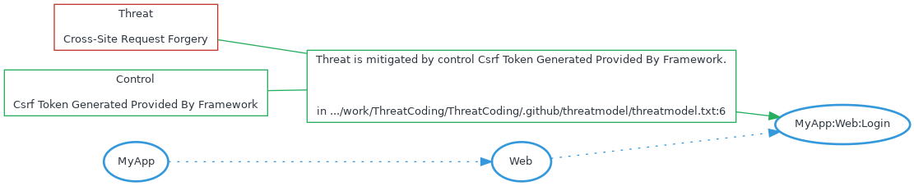

# Projeto Protótipo Threat Model

Projeto utilizando o githubactions como pipeline para subir o threatmodelling de um projeto


# Diagram



# Exposures


# Acceptances


# Transfers


# Mitigations

## Cross-site request forgery against MyApp:Web:Login mitigated by Csrf token generated provided by framework


```

```
/home/runner/work/ThreatCoding/ThreatCoding/.github/threatmodel/threatmodel.txt:6


# Reviews


# Connections


# Components

## MyApp:Web:Login


# Threats

## Cross-site request forgery


# Controls

## Csrf token generated provided by framework
